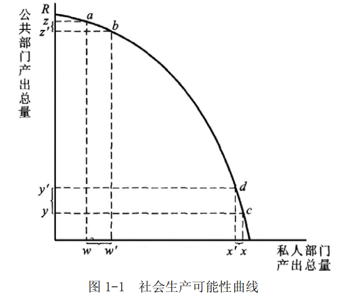
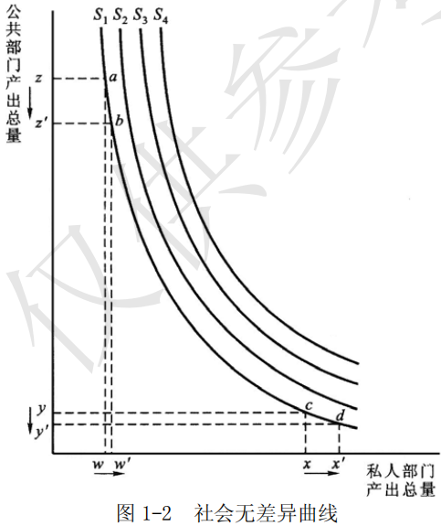
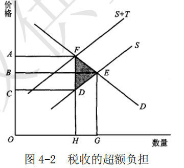

## 第 1 章 财政职能

### 一、名词解释

#### 1．免费搭车行为

免费搭车行为是指不承担任何成本而消费或使用公共物品的行为，有这种行为的人或具有让别人付钱而自己享受公共物品收益动机的人称为免费搭车者。
免费搭车现象缘于公共物品生产和消费的非排他性和非竞争性。免费搭车行为往往导致公共物品供应不足。

#### 2．投票规则

投票规则是通过投票进行决策的一种公共选择程序规则。投票规则有两类：一致同意规则和多数票规则。
一致同意规则是指一项政策或议案，须经全体投票人一致赞同才能通过的一种投票规则，这是最符合公共利益要求的投票规则，但因其实质是一票否决制，故在现实生活中很难实施；多数票规则是指一项政策或议案，须经半数以上投票人赞同才能通过的一种投票规则，又分为简单多数票规则和比例多数票规则，多数票规则往往导致循环投票并且不能反映个人的偏好程度，容易造成政府失灵。

#### 3．寻租行为

寻租行为是指通过游说政府活动获得某种垄断权或特许权，以赚取超常利润或租金的行为。政府的某些干预形式，如颁发许可证、授权书、批文、特许经营等，为寻租行为的产生创造了条件。寻租行为越多，社会资源的浪费就越大。

#### 4．政府失灵

政府失灵是指政府的活动或干预措施缺乏效率，或者说，政府作出了降低经济效率的决策或不能实施改善经济效率的政策。政府失灵或政府干预的缺陷主要表现在以下几方面：
（1）短缺和过剩。如果政府于预的方式是把价格固定在非均衡水平上，那么，不是产生短缺就是产生过剩问题。
（2）信息不足。政府不一定知道其政策的全部成本和收益，也不十分清楚其政策的后果，难以进行政策评价。
 (3）官僚主义。政府决策过程也许高度僵化和有严重的官僚主义问题，可能存在大量的重复劳动和繁文缛节。
（4）缺乏市场激励。政府干预消除了市场力量，或冲抵了它们的作用，干预就可能消除某些有益的激励。
（5）政府政策的频繁变化。如果政府干预的政策措施变化得太频繁，行业的经济效率就会蒙受损失，因为企业难以规划生产经营活动。

### 二、简述题

#### 1．简述社会公共需要的基本特征。

社会公共需要是相对于私人个别需要而言的，指向社会提供安全、秩序、公民基本权利和经济发展的社会条件等方面的需要。社会公共需要包括政府执行其职能以及执行某些社会职能的需要，如国防、文教、卫生、生态环境保护的需要以及基础设施、基础产业和支柱产业、风险产业的投资；广义上还包括为调节市场经济运行而采取的各种措施等。社会公共需要具有以下特征：

- （1）非加总性。社会公共需要是社会公众在生产、生活和工作中的共同需要，它不是普遍意义上的人人有份的个人需要或个别需要的数学加总。
- （2）无差异性。为了满足社会公共需要而提供的公共物品，可以无差别的由每个社会成员共同享用，一个或一些社会成员享用这种公共物品，并不排斥其他社会成员享用。
- （3）代价的非对称性。社会成员享用为满足社会需要的公共物品，无需付出任何代价，或只支付与提供这些公共物品的所费不对称的少量费用。
- （4）外部性。为满足社会公共需要而提供的公共物品一般具有外部效应。外部效应指的是一个消费者的消费行为或生产者的生产行为给其他消费者或生产者带来利益或损失。外部效应往往会导致公共物品供给的过度与不足。
- （5）社会剩余产品性。满足社会公共需要的物质手段只能来自社会产品的剩余部分，如果剩余产品表现为价值形态，就只能是对“M”部分的抽取。

#### 2．简述财政职能的基本内容。

财政职能是指财政作为一个经济范畴所固有的功能。在社会主义市场经济条件下，财政职能可概括为四个方面，即资源配置职能、收入分配职能、经济稳定职能和经济发展职能。

- （1）资源配置职能。资源配置职能是指政府主要通过税收动员社会资源，通过财政支出提供公共物品，实现经济资源的合理流动和配置。
- （2）收入分配职能。收入分配职能是指政府通过收入支出制度，对不同收入阶层征税或不征税、多征税或少征税，从事增加低收入阶层的支出项目，实现对市场活动产生的收入分配状况的合理调整。
- （3）经济稳定职能。经济稳定职能是指政府在失业和经济萧条时期实行赤字财政，在充分就业和通货膨胀压力很大时期实行盈余财政，熨平经济波动。
- （4）经济发展职能。经济发展职能是指政府主要通过税收优惠政策，调整支出结构，以经济增长为核心，以结构调整为重点，促进社会经济的持续发展。

财政职能之所以具有上述功能，是由于市场失灵往往会导致资源配置扭曲，收入不公、经济波动以及总量不平衡。

#### 3．简述政府机构运转无效率的主要原因。

公共选择理论认为，政府机构运转无效率的原因主要表现在缺乏竞争、缺乏降低成本的激励两个方面。
- （1）缺乏竞争导致的无效率。
	- 首先是政府工作人员之间缺乏竞争，因为大部分官员和一般工作人员是逐级任命和招聘的，且“避免错误或失误”成为政府官员的行为难则，故他们没有竞争的压力去高效率地工作。
	- 其次是在政府部门之间缺乏竞争，因为政府各部门提供的服务是特定的，无法直接评估政府各部门内部的行为效率，也不能评价各部门问的运行效率，更难以设计出促使各部门展开竞争、提高效率的机制。
- （2）缺乏降低成本的激励导致的无效率。
	- 从客观来看，由于政府部门的活动大多不计成本，即使计算成本，也很难做到准确，再加上政府部门具有内在的不断扩张的冲动，往往出现公共物品的过度提供，造成社会资源的浪费。
	- 从主观来看，政府各部门对其所提供的服务一般具有绝对的垄断性，正因为有这种垄断地位，也就没有提高服务质量的激励机制。此外，由于政府部门提供的服务比较复杂，它们可以利用所处的垄断地位隐瞒其活动的真实成本信息，无法评价其运行效率．难以进行充分的监督和制约。

### 三、论述题

#### 1．请利用无差异分析方法，分析政府部门和市场部门间的最优资源配置。

整个社会可分为两大部门:
- 即政府部门（公共部门）
- 市场部门（私人部门）

在社会经济资源既定并且稀缺的情况下，两大部门各自配置多少资源，不仅关系到政府经济活动的界限问题，还关系到整个社会的资源配置效率问题。在社会成员的偏好格局和有效需求既定的情况下，两大部门间的资源配置可能存在着某种最优组合。下面利用无差异分析方法，分析政府部门和市场部门间的最优资源配置。
- （1）社会生产可能性曲线

在图 1-1 中，R 代表整个社会的生产可能性曲线，它把私人物品的生产和公共物品的生产之间的边际转换率与该社会可利用的稀缺的生产性资源联系在一起。也就是说，它表明的是在某一既定的时点上，该社会可利用的无论是在数量上还是在质量上都有限的土地、劳动和资本资源得到充分利用时所能生产出来的私人物品和公共物品的各种组合。图 1-1 中的生产可能性曲线的位置越高，该社会的生产潜能越大，因为该社会的生产性资源的质量越高，数量越大。

- （2）社会无差异曲线

在图 1-2 中，每一条社会无差异曲线 S1， S2 ， S3 和 S4 都代表一定的满足水平，表明社会对私人物品和公共物品消费的边际替代率。也就是说，每条曲线表明的是私人物品和公共物品的各种组合，每种组合向社会提供的福利水平是不变的。但是，位置越高的社会无差异曲线，代表的社会福利水平越高，因为被消费的总产出越大。

- （3）部门间的最优资源配置点

根据无差异分析，将社会生产可能性曲线和社会无差异曲线放在同一个图形中，如图 1-3 所示。在图中，社会生产可能性曲线 R 与社会无差异曲线 S3 相切于 A 点，这决定了部门间最优资源配置，即市场部门的产出为 7500亿元，政府部门的产出为 2500 亿元。在 A 点，私人物品生产和公共物品生产的边际转换率等于社会对这些物品消费的边际替代率，社会消费这些物品获得了最大福利。

- （4）部门间的现实资源配置可能没有位于最优配置点 A 上。比如图 1-3 中，在 B 点，资源过度配置到公共部门；在C 点，资源过度配置到私人部门。不过，这两点都位于生产可能性曲线 R 上，都代表资源得到充分利用。而 D 点处于生产可能性曲线 R 之内，表明社会对生产性资源利用不足。

- （5）随着时间的推移，部门间的资源配置可能发生变化。
	- ①部门间最优资源配置不变的情况下，部门间的现实资源配置发生变化，比如，从最优的现实配置点移动到非最优配置点，或从非最优的现实配置点移动到最优配置点。
	- ② R 曲线和 S 曲线都有可能发生变化，很可能会形成一个新的部门间最优配置点。前者可能是由于生产性资源的数量和（或）质量的增减而变化，后者可能是由于社会对公共物品和私人物品的偏好发生变化，或收入、财富的分配状况发生变化。

#### 2．阐述公共选择理论关于政府失灵原因的分析。

政府失灵是指政府的活动或干预措施缺乏效率，或者说，政府做出了降低经济效率的决策或不能实施改善经济效率的政策。政府失灵的主要原因包括政府决策的无效率、政府机构运转的无效率和政府干预的无效率。

- （1）政府决策的无效率
公共选择理论在用经济模型分析政治决策时指出，民主程序不一定能产生最优的政府效率。
- ①投票规则的缺陷导致政府决策无效率。投票规则有两种，
	- 一是一致同意规则，
	- 二是多数票规则。
	常用的投票规则是多数票规则。多数票规则也不一定是一种有效的集体决策方法。
	首先，在政策提案超过两个以上时，会出现循环投票，投票不可能有最终结果。
	其次，为了消除循环投票现象，使集体决策有最终的结果，可以规定投票程序。
	但是，确定投票程序的权力往往是决定投票结果的权利，谁能操纵投票程序，谁也就能够决定投票结果。
	再次，多数票规则不能反映个人的偏好程度，无论一个人对某种政治议案的偏好有多少强烈，它只能投一票，没有机会表达其偏好程度。

- ②政治市场上行为主体动机导致政府决策无效率。
	公共选择理论认为，政府只是一个抽象的概念，在现实中，政府是由政治家和官员组成的，政治家的基本行为动机也是追求个人利益最大化。因此，政治家追求其个人目标时，未必符合公共利益或社会目标，而使广大选民的利益受损。

- ③利益集团的存在导致政府决策无效率。
	利益集团又称压力集团，通常是指那些有某种共同的目标并试图对公共政策施加影响的有组织的团体。在许多情况下，政府政策就是在许多强大的利益集团的相互作用下作出的。而这些利益集团，特别是还可能拥有不正当政治权势的利益集团，通过竞选捐款、院外游税、直接贿赂等手段，对政治家产生影响，左右政府的议案和选民的投票行为，从而使政府作出不利于公众的决策。

- （2）政府机构运转的无效率

公共选择理论认为，政府机构运转无效率的原因主要表现在缺乏竞争、缺乏激励两个方面。

- ①缺乏竞争导致的无效率

首先是政府工作人员之间缺乏竞争，因为大部分官员和一般工作人员是逐级任命和招聘的，且“避免错误或失误”成为政府官员的行为准则，故他们没有竞争的压力去高效率地工作。其次是在政府部门之间缺乏竞争，因为政府各部门提供的服务是特定的，无法直接评估政府各部门内部的行为效率，也不能评价各部门间的运行效率，更难以设计出促使各部门展开竞争、提高效率的机制。

- ②缺乏降低成本的激励导致的无效率

从客观来看，由于政府部门的活动大多不计成本，即使计算成本，也很难做到准确，再加上政府部门具有内在的不断扩张的冲动，往往出现公共物品的过度提供，造成社会资源的浪费。从主观来看，政府各部门对其所提供的服务一般具有绝对的垄断性，正因为有这种垄断地位，也就没有提高服务质量的激励机制。此外，由于政府部门提供的服务比较复杂，它们可以利用所处的垄断地位隐瞒其活动的真实成本信息，无法评价其运行效率，难以进行充分的监督和制约。

- （3）政府干预的无效率

为了确保正常而顺畅的社会经济秩序，政府必须制定和实施一些法律法规。
但是，有些政府干预形式，比如政府颁发许可证、配额、执照、授权书、批文、特许经营证等，可能同时为寻租行为创造了条件。因为在这种制度安排下，政府人为地制造出一种稀缺，这种稀缺就会产生潜在的租金，必然出现寻租行为。寻租行为一般是指通过游说政府和院外活动获得某种垄断权或特许权，以赚取超常利润（租金）的行为。寻租行为越多，社会经济资源浪费越大。

## 第 2 章 财政支出规模与结构

### 一、名词解释

#### 1．购买性支出

按照经济性质分类，财政支出可以分为购买性支出和转移性支出。购买性支出是指政府购买商品和服务的开支，包括购买进行日常政务活动所需的或用于国家投资所需的商品和服务的支出，它体现的是政府的市场再分配活动。在财政支出中，购买性支出所占的比重越大，财政活动对生产和就业的直接影响就越大，通过财政所配置的资源的规模也就越大。购买性支出占较大比重的财政活动，执行资源配置的职能较强。

#### 2．转移性支出

按照经济性质分类，财政支出可以分为:
- 购买性支出
- 转移性支出

转移性支出指政府资金无偿的、单方面的转移。主要有补助支出、捐赠支出和债务利息支出，它体现的是政府的非市场性再分配活动。
在财政支出总额中，转移性支出所占的比重越大，财政活动对收入分配的直接影响就越大。转移性支出占较大比重的财政活动，执行收入分配的职能较强。

#### 3．政府采购制度

政府采购制度是指中央政府、地方政府及法律规定的其他实体以法定的方式向社会采购物资、工程或服务，并对采购过程进行监督管理的一种控制制度。它具有公开性、公正性、竞争性的特点，其中公平竞争是政府采购制度的基石。这一制度主要包括采购计划的制定和审批、采购程序的管理和监督、采购效果的审计和检查等。

#### 4．成本—效益分析法

成本—效益分析法是指针对政府确定的建设目标，提出若干实现建设目标的方案，详列各种方案的全部预期成本和全部预期效益，通过分析比较，选择出最优的政府投资项目的一种分析方法。
成本—效益分析事实上包含了两个过程：
- 第一个过程是政府确定备选项目和备选方案；
- 第二个过程是政府选择方案和项目的过程

成本—效益分析法的运用，最关键的问题是如何确定项目的效益、成本和贴现率。在项目选择的过程中，一般的原则是选择支出既定情况下的净社会效益最大的项目。成本—效益分析方法往往运用于政府投资项目的评价。

#### 5．最低费用选择法

最低费用选择法一般不用货币单位来计量备选的财政支出项目的社会效益，只计算每项备选项目的有形成本，并以成本最低为择优的标准。运用最低费用选择法时，首先要提出多种备选方案，计算出备选方案的有形费用，并按照费用的高低排出顺序，以供决策者选择。这种方法适用于事业单位的支出评价。

#### 6．公共定价法

公共定价法是指政府对公共企业生产的商品和服务的定价或政府对私人部门定价的管制。
公共定价法包括两个方面：
- 一是纯公共定价法，即政府直接制定自然垄断行业的价格；
- 二是管制定价或价格管制，即政府规定竞争性管制行业（如金融、农业、教育和保健等行业）的价格。

政府使用公共定价法，目的不仅在于提高整个社会资源的配置效率，而且更重要的是使这些物品和服务得到最有效的使用，提高财政支出的效率。公共定价法包括平均成本定价法、二部定价法和负荷定价法。

### 二、简述题

#### 1．简述财政支出按费用类别分类的基本内容。

按费用类别所做的分类，也就是按国家职能所做的分类。由于国家的职能包括经济管理职能和社会管理职能，财政支出据此可分为:
- 经济管理支出
- 社会管理支出

我国依据国家职能的划分，将财政支出区分为五大类：
- 经济建设费
- 社会文教费
- 国防费
- 行政管理费
- 其他支出。

按国家职能对财政支出分类，能够揭示国家执行了怎样一些职能以及侧重于哪些职能；
对一个国家的支出结构作时间序列分析，便能够揭示该国的国家职能发生了怎样的演变；
对若干国家在同一时期的支出结构作横向分析，则可以揭示各国国家职能的差别。

我国不论是改革开放前还是改革开放后，经济建设费都是最大的财政支出项目。但是，改革开放以来，经济建设费占财政支出的比重不断下降，而社会文教费、行政管理费所占比重一直在稳定上升。这说明国家的经济建设职能正在向社会管理职能转变。

#### 2．简述政府采购制度如何提高财政支出效益。

政府采购制度是以公开招标、投标为主要方式选择供应商，从国内外市场上为政府部门或所属团体购买商品或服务的一种制度。它具有公开性、公正性、竞争性，其中公平竞争是政府采购制度的基石。
政府采购制度从三个层次上有利于财政支出效益的提高：

- （1）从财政部门自身的角度来看，政府采购制度有利于政府部门强化支出管理，硬化预算约束，在公开、公正、公平的竞争环境下，降低交易费用，提高财政资金的使用效率。

- （2）从政府部门的代理人角度来看，通过招标竞价方式，优中选优，具体的采购实体将尽可能地节约资金，提高所购买货物、工程和服务的质量，提高政府采购制度的实施效率。

- （3）从财政部门代理人与供应商之间的关系角度来看，由于政府采购制度引入了招标、投标的竞争机制，使得采购实体与供应商之间的“合谋”型博弈转化为“囚徒困境”型博弈，大大减少他们之间的共谋和腐败现象，

在很大程度上避免了供应商（厂商）和采购实体是最大利益者而国家是最大损失者问题。

### 三、论述题

#### 1．如何认识和调整我国目前的财政支出结构？

- （1）我国财政支出结构的现状

- ①财政支出结构是指各类财政支出占总支出的比重，也被称为财政支出构成。财政支出结构直接关系到政府动员社会资源的程度，财政支出结构对市场经济运行的影响可能比财政支出规模的影响更大。一国财政支出结构的现状及其变化，表明了该国政府正在履行的重点职能以及变化趋势。

- ②政府职能可以简化为两大类：
	- 经济管理职能
	- 社会管理职能
	财政支出也就相应的形成了经济管理支出和社会管理支出。随着社会主义市场经济体制的确立，政府的经济管理职能逐渐弱化，社会管理职能日益加强。我国的财政支出结构也随之发生变化，经济建设支出占财政支出总额的比重下降。

- ③我国经济建设支出下降的原因
	改革开放以来，我国经济建设支出下降的原因有二个：
	- 一是流动资金支出下降
	- 二是基本建设支出下降。

- ④社会管理支出增长中的合理与不合理因素：
	- ①社会文教费的增长是合理的；
	- ②行政管理费的增长不尽合理；
	- ③行政支出内部结构发生不合理变化，主要表现在个人经费增长快于公用经费增长。

- （2）财政支出结构的调整

	- ①我国目前的财政支出结构不尽合理
		判断一国财政支出结构是否合理，至少应从两个方面来分析：
		- 一是该国所处的经济发展阶段以及在该阶段政府所追求的主要经济政策目标，
		- 二是财政支出各项目间的相对增长速度。
		具体而言，我国处于社会主义初级阶段，经济增长无疑是政府追求的主要经济政策目标，而从财政支出角度来看，实现可持续经济增长的主要财政政策工具是财政投资。可是，十余年来，财政投资的规模虽然增加了，但所占比重在不断下降，这种趋势必将抑制经济的快速增长。在财政支出总额中，消费性支出的比重过大，而且增长速度大大超过生产性支出的增长速度。

	- ②优化财政支出结构的基本思路
		优化财政支出结构的基本思路是：
		- 一方面，按照社会公共需要的先后次序，合理界定财政支出范围；
		- 另一方面，根据当前的经济政策目标，在增量支出中逐步调整和理顺生产性支出与消费性支出的比例关系。

		在调整财政支出结构过程中，在适当提高财政投资支出比重的同时，重点应放在控制消费性支出的快速增长上。而控制消费性支出过快增长的主要措施是在明确政府职能的前提下，精简机构，控制行政机关人员，削减消费性支出。

#### 2．试述财政支出规模增长趋势的理论解释。

财政支出增长似乎是市场经济国家经济发展中的一条规律。社会主义国家的财政支出占 GDP 的比率在改革以前呈现了扩张的趋势；改革时期财政支出比率有所下降，是因为政府在尽力摆脱包得过多、统得过死的情况。一旦经济体制迈上市场经济的运行轨道并达到一定阶段以后，上述下降趋势理应逆转，改革支出财政支出比率下降的趋势可能会在某一时期中止，转而趋于回升，并达到适度水平而相对停滞。
目前为止，理论界关于财政支出规模增长趋势的理论解释有以下四种：

- （1）政府活动扩张论
政府活动扩张论也被称为“瓦格纳法则”。
瓦格纳法则可以表述为：随着人均收入的提高，财政支出的相对规模也随之提高。
德国经济学家瓦格纳认为，现代工业的发展会引起社会进步，社会进步必然导致国家活动的增长。他把导致政府支出增长的因素分为政治因素和经济因素。所谓政治因素，是指随着经济的工业化，正在扩张的市场与这些市场中的当事人之间的关系会更加复杂，市场关系的复杂化引起了对商业法律和契约的需要，并要求建立司法组织执行这些法律，这样就需要把更多的资源用于提供治安和法律设施。所谓经济因素，则是指工业的发展推动了都市化的进程，人口的居住将密集化，由此将产生拥挤等外部性问题，也需要政府进行管理与调节。

- （2）梯度渐进增长论

梯度渐进增长论也被称为“内外因素论”。英国经济学家皮库克与威斯曼提出了导致公共支出增长的内在因素与外在因素，并认为外在因素是说明公共支出增长超过 GDP 增长速度的主要原因。在正常条件下，经济发展，收入水平上升，以不变的税率所征得的税收也会上升，于是，政府支出上升会与 GDP 上升成线性关系。这是内在因素作用的结果。但一旦发生了外部冲突，比如战争，政府会被迫提高税率，而公众在危急时期也会接受税率提高，即税收容忍度提高了；同时，此时产生所谓“替代效应”，即在危急时期，公共支出会替代私人支出，公共支出的比重增加。但在危急时期过去以后，公共支出并不会退回到上升之前的水平。一般情况是，一个国家在结束战争之后，总有大量的国债，公共支出会持续很高。

- （3）经济发展阶段论

美国经济学家马斯格雷夫和罗斯托利用经济发展阶段论来解释公共支出增长的原因。他们认为，在经济发展的早期阶段，政府投资在社会总投资中占有较高的比重，公共部门为经济发展提供社会基础设施，如道路、运输系统、环境卫生系统、法律与秩序、健康与教育以及其他用于人力资本的投资等等。在发展的中期阶段，政府投资还应继续进行，但这时政府投资只是对私人投资的补充。一旦经济达到成熟阶段，公共支出将从基础设施支出转向不断增加的教育、保健与福利服务的支出，且这方面的支出增长将大大超过其他方面支出的增长，也会快于GDP 的增长速度，导致财政支出规模膨胀。

- （4）官僚行为增长论

按照公共选择理论的观点，官僚是指负责执行通过政治制度做出的集体选择的代理人集团，或更明确地说是指负责政府提供服务的部门。
美国经济学家尼斯克南认为，和理性经济人的自利性特征类似，官僚以追求机构最大化为目标；机构规模越大，官僚们的权力越大。正因为官僚机构以机构规模最大化作为目标，导致财政支出规模不断扩大，甚至财政支出规模增长超出了共用品最优产出水平所需要的支出水平。此外，由于官僚机构通常拥有提供共用品的垄断权。在很多情况下，他们掌握着特殊信息，这就使其能让政治家们相信他们确定的产出水平的社会收益比较高，从而实现预算规模最大化的产出。又由于交易成本很高，拨款机构很难控制官僚行为。因此，官僚机构通常以两种方式扩大其预算规模。
	- 第一，他们千方百计让政府相信他们确定的产出水平是必要的。
	- 第二，利用低效率的生产技术来增加生产既定的产出量所必需的投入量（增加预算、附加福利、工作保障，减少工作负荷），这时的效率损失不是源于官僚服务的过度提供，而是由投入的滥用所致。

由此可见，官僚行为从产出和投入两个方面迫使财政支出规模不断膨胀。

## 第 3 章 财政投资支出和社会保障支出

### 一、名词解释

#### 1．就业创造标准

就业创造标准是指政府应当选择单位投资额能够动员最大数量劳动力的项目。这种标准要求政府不仅要在一定程度上扩大财政投资规模（外延增加就业机会），而且还要优先选择劳动力密集型技术的项目（内涵增加就业机会）。主张这种标准的理由是，政府在决定财政投资的支出时，要尽可能地估价这种投资支出可能产生的总就业机会。换言之，不仅要考虑财政投资支出的直接就业影响，还要考虑间接就业影响——财政投资项目带动的其他投资项目所增加的就业机会。这一标准强调劳动力这一生产要素，认为增加就业机会，减少失业是财政投资项目的目标。

#### 2．财政投融资

财政投融资是指以国家的信用为基础，通过多种渠道筹措资金，有偿地投资于具有公共性的领域。
它是一种政策性投融资，既不同于一般的财政投资，也不同于一般的商业性投资，而是介于这两者之间的一种新型的政府投资方式。财政投融资具有有偿性、公共性、非营利性、统筹性和灵活性等特点。

#### 3．建设－经营－转让投资方式

建设－经营－转让投资（BOT）方式是指政府将一些拟建的基础设施建设项目通过招商转让给某一财团或公司，由其组建一个经营公司进行建设经营，并在双方协定的一定时期内，由该项目公司通过经营该项目偿还债务，收回投资，协议期满，项目产权转让给政府，这种基础设施投资方式在近些年来比较盛行，它最大的特点在于鼓励和吸引私人投资者特别是外国直接投资者对发电厂（站）、高速公路、能源开发等基础设施进行投资。

#### 4．社会保障

社会保障是指政府通过专款专用税筹措资金，向老年人、无工作能力的人、失去工作机会的人、病人等提供基本生活保障的计划。社会保障制度是伴随近代大工业而产生的。政府提供社会保障的主要经济原因是保险市场的失灵。我国社会保障制度由四个方面的内容构成，即社会保险、社会救济、社会福利和社会优抚。
社会保险是社会保障制度的核心，由五项组成：
- 养老保险
- 失业保险
- 医疗保险
- 工伤保险
- 生育保险。

在社会保险制度中，养老保险又是最重要的。

### 二、简述题

#### 1．简述我国现阶段的财政投资决策标准。

与民间投资相比，财政投资追求的是社会收益最大化而非私人收益最大化，而且财政投资的资金来源有很大一部分是通过税收无偿取得的。正因为这些特点，政府在财政投资决策时所依据的标准不同于私人部门，而且政府最终依据怎样的投资决策标准，取决于政府在不同时期所要实现的政策目标。我国现阶段的财政投资标准有：

- （1）资本－产出比率最小化标准

资本－产出比率最小化标准，又被称为稀缺要素标准，是指政府在确定投资项目时，应当选择资本－产出比率最低的投资项目，或者说选择单位资本投入产生最大产出的投资项目。这种标准是针对大多数发展中国家的资本资源相对短缺这种实际情况提出来的。主张这种标准的理由是，即使一国在一定时期内的储蓄率是既定的，但资本－产出比率是可变的，在生产过程中，只要提高资本周转率或产出－资本比率，就可以使产出最大化，实现预期增长率。

- （2）资本－劳动力比率最大化标准

资本－劳动力比率最大化标准，是指政府投资支出应当选择使边际人均投资额最大化的投资项目。主张这种标准的理由是，资本－劳动力比率越高，说明资本技术构成越高，劳动生产率越高，经济增长越快。因此，这种标准强调政府应投资于资本密集型项目。

- （3）就业创造标准

就业创造标准是指政府应当选择单位投资额能够动员最大数量劳动力的项目。这种标准要求政府不仅要在一定程度上扩大财政投资规模（外延增加就业机会），而且还要优先选择劳动力密集型技术的项目（内涵增加就业机会）。主张这种标准的理由是，政府在决定财政投资的支出时，要尽可能地估价这种投资支出可能产生的总就业机会。换言之，不仅要考虑财政投资支出的直接就业影响，还要考虑间接就业影响——财政投资项目带动的其他投资项目所增加的就业机会。

在上述三种标准中，前两种标准有一个共同的特点，即都强调资本这种稀缺要素在经济增长过程中的重要性和贡献，所以要求政府在确定投资项目时，要尽可能地选择节省资本（资本－产出比率最小化标准）或增加资本（资本－劳动力比率最大化标准）的项目。后一个标准强调劳动力这一生产要素，增加就业机会，减少失业是财政投资项目的目标。

#### 2．简述政府对农村和农业投资的重点。

为了尽快有效解决“三农”（农村、农业、农民）问题，全面建设小康社会，我国政府必须加大对农村和农业的财政投入。在国家投资有限的情况下，要提高国家投资的效率，关键的问题是正确选择财政投资的重点。
财政投资的重点应当包括以下几个方面：

- （1）农村和农业基础设施的投资

农村基础设施投资主要有农村基础教育、卫生设施的投资以及交通道路、电网建设的投资。农业基础设施主要是进一步加强大江、大河、大湖的综合治理，集中资金兴建一批具有综合效益的大中型水利工程，以改善农业生产条件，提高农业综合生产能力。

- （2）农业生态环境领域的投资

要改善农业生产条件，确保农业可持续发展，农业生态环境的保护非常重要。政府应增加绿化、水土保持和防护林建设的投入，加大改善农业生态环境的投资力度。

- （3）农业研发和科技推广领域的投资

农业发展的根本途径在于改造传统农业，提高农业劳动生产率，这就需要政府增加农业研发和科技推广领域的投资。
比如，扶持农业科研单位开展农业科学研究，推动新品种和新技术的开发；增加农业技术推广投入，特别要注重对粮棉油等农作物有明显的节工、增产、增效作用的良种应用、科学用肥、模式化栽培、病虫害防治、节水灌溉等技术的推广；增加农业部门的教育和培训的经费投入，使大多数从事生产的劳动力成为“熟练工人”。

#### 3．简述养老保险制度的三种筹资模式。

养老保险制度从其筹资方式来说可分为以下三种模式：

- （1）完全基金制

完全基金制是用过去积累的缴款所挣取的利息收入提供保险金的制度。具体来说，就是工人在就业期限或寿命内向社会保险计划缴款，这些缴款存入政府管理的基金中，该项基金随着时间的推移不断积累并生息；当一个工人退休后，每年领取的保险金主要来自其中的利息收入。

- （2）现收现付制

现收现付制是用当期的缴款提供保险金的制度。换句话说，支付给当期接受者的保险金来自于现在工作的人缴纳的税收，也就是通常所说的社会保障税，有的国家也称为社会保险税或工薪税。

- （3）部分基金制

部分基金制是既具有完全基金制的部分特征又具有现收现付制部分性质的混合制度。社会保障税的一部分用来支付当期接受者的保险金，一部分（剩余部分）投资于政府管理的基金（或称为社会保障信托基金），该基金用来支付将来的保险金。

#### 4．简述“十五”时期以来我国财政加大“三农”投入的主要措施。

“十五”时期以来，财政部门认真贯彻落实国家对“三农”投入的政策精神，连续采取多项措施，不断加大对“三农”的投入。主要措施有：

- （1）深化以税费改革为中心的农村综合改革。
	从 2004 年减免农业税和取消除烟叶以外的农业特产税，2006年全面取消农业税。这一政策的实施，减轻农民负担 1250 亿元，人均减负 140 元，为此，中央财政于 2004～2006年安排转移支付资金 1968.3 亿元。

- （2）实行“三补贴”政策。
	从 2004 年起，调整粮食风险基金使用结构，实行“三补贴”政策，即对种粮农民按种植面积实行直接补贴，对部分地区农民实行良种推广补贴和农机具购置补贴，2006 年又因部分农业生产资料涨价对种粮农民实行综合补贴，3 年来累计补贴 632.6 亿元。

- （3）大力支持农业综合生产能力建设。
	主要表现在增大对农业和农村基础设施建设、生态建设、科技进步、综合开发等方面的投入。2006 年中央财政用于“三农”资金增长 14．2%，高于上年 0.9 个百分点，国家基建支出预算用于农业投资的比例为 45.7%，高于上年 1 个百分点，新增预算内基建投资 100 亿元，直接用于改善农村生产生活条件。2003～2006 年，支持重点林业生态工程建设资金累计达 961.6 亿元，保护天然林和营造林木资金 326.7 亿元，森林生态效益补偿补助金 80 亿元。

- （4）着力建立农村义务教育经费保障机制，全部免除西部地区农村中小学生学杂费。
	从 2006 年起，按照“明确各级责任、中央地方分担、加大财政投入、提高保障水平、分步组织实施”的原则，逐步将农村义务教育全面纳入财政保障范围，建立中央和地方分项目、按比例负担的农村义务教育保障机制。预计 2006 年至 2010 年累计新增农村义务教育经费将达 2182 亿元，同时，大力支持职业教育，加大对职业教育实验培训基地建设的支持力度。

- （5）加大农村基本医疗、公共卫生和社会保障投入，促进城乡基本公共服务均等化。
	支持新型农村合作医疗试点，将试点范围扩大到全国 40%的县（市、区），中央和地方财政补助标准均由 10 元提高到 20 元，中央相应安排资金 47.3 亿元，增长 7 倍多，同时，加强医疗救助工作，缓解“因病致贫、因病返贫”现象。探索建立农村社会保障制度，各级财政积极筹措资金，支持建立各种形式的农村社会保障制度。

- （6）大力推进农村综合开发投资参股经营试点，带动社会资金投入农业和农村综合开发。
	为发挥市场机制在农业和农村开发中的积极作用，从 2004 年开始在河北、河南等省进行国家开发资金投资参股经营试点，目前试点范围在继续扩大。试点主要遵循以下原则：自愿申报、平等竞争、择优扶持；谁投资、谁所有、谁受益、谁承担风险；政企分开、委托监管、授权运营；规范操作、稳步推进、适时退出。投入的财政资金只参股，不控股，不做第一大股东，财政（农业）部门根据需要授权资产运营机构进行资本运营。

### 三、论述题

#### 1．我国现阶段应当采用哪种财政投资决策标准？为什么？

财政投资的决策标准包括资本—产出比率最小化标准、资本—劳动力比率最大化标准以及增加就业标准。
我国现阶段应以就业创造标准作为财政投资决策标准，理由如下：

- （1）从理论上说，劳动力是最重要的经济资源，失业的存在是对战略资源的不容宽恕的浪费；而且，就业增加一般都会增加产出。
- （2）我国劳动力资源十分丰富，政府必须从全局战略考虑这一资源的充分利用，财政投资项目是创造就业机会的有效途径。

- （3）即使不考虑产出增加，也有很多理由表明增加就业是必要的，原因之一是失业的社会影响。许多社会问题可能就导源于大量失业的存在：目无法纪、到处流浪、犯罪、社会秩序混乱，甚至出现有组织的暴乱。从这个意义上说，增加就业的社会利益远远超出了增加产出的意义。
- （4）财政投资的就业创造标准还有助于改善收入分配状况。一般来说，失业会使一个家庭陷入贫困。政府虽然可以通过税收和一次性转移支出等措施缓解收入分配不公平状况，但是往往受到政治和社会因素的限制。要增加贫困家庭的收入，根本措施还在于增加就业。而增加就业规模首先要增加就业机会，增加贫穷者就业机会的一个途径是扩大财政投资，因为私人投资决策考虑的主要是投资收益，而不是创造就业机会。特别是增加落后经济地区的财政投资，对整个社会的收入分配公平、福利水平的提高具有重大意义。

#### 2．从解决“三农”问题的角度，谈谈政府加大对农村和农业财政投资的必要性和重点。

- （1）财政对农村和农业投资的必要性

为了尽快有效解决“三农”（农村、农业、农民）问题，全面建设小康社会，我国政府必须加大对农村和农业的财政投入。主要有四方面的原因：

- ①我国农村人口众多，农村各项事业的发展相对落后。我国要全面建设小康社会，关键在于解决“三农”问题，而解决这一问题的主要措施是加快农村城镇化、农业产业化和增加农民收入。可是，鉴于我国农村和农业的发展现状，不加大政府的财政投入，上述措施就难以落到实处。
- ②农业是国民经济的基础，也是我国最亟待发展的产业。农业不仅为非农业部门提供劳动力，提供食品和原料，而且农业还能够扩大国内市场规模，农产品出口能够赚取宝贵的外汇。
- ③农业部门生产率较低，自身难以产生足够的积累。我国农业生产受自然条件制约，仍属于“靠天吃饭”，再加上农产品附加价值不高，农业生产者的私人或集体资本积累缓慢，很难吸引优质资源进入农业，甚至连农业自身的资源也会向收益率较高的其他行业转移。
- ④许多农业投资项目只适于由政府来进行。如大型水库和各种灌溉工程等，其特点是投资量大，投资期限长，牵涉面广，投资以后产生的效益不易分割，而且投资的成本及其效益之间的关系不十分明显。

- （2）财政投资的重点
在了解农村和农业财政投资的必要性的同时，还要注重国家投资的效率，特别是在国家投资有限的情况下，
更要正确选择财政投资的重点：

- ①农村和农业基础设施的投资。
	农村基础设施投资主要有农村基础教育、卫生设施的投资以及交通道路，电网建设的投资。农业基础设施主要是进一步加强大江、大河、大湖的综合治理，集中资金建一批具有综合效益的大中型水利工程，以改善农业生产条件，提高农业综合生产能力。

- ②农业生态环境领域的投资。
	政府应增加绿化、水土保持和防护林建设的投入，加大改善农业生态环境的投资力度。

- ③农业研发和科技推广领域的投资。
	农业发展的根本途径在于改造传统农业，提高农业劳动生产率，这就需要政府增加农业研发和科技推广领域的投资。例如，扶持农业科研单位开展农业科学研究，推动新品种和新技术的开发；增加农业技术推广投入，增加农业部门的教育和培训的经费投入等。

## 第 4 章 税收原理

### 一、名词解释

#### 1．累进税率

累进税率是指按课税对象数额的大小，划分若干等级，每个等级由低到高规定相应的税率，课税对象数额越大税率越高，数额越小税率越低。累进税率因计算方法的不同，又分为全额累进税率和超额累进税率两种。

全额累进税率是把课税对象的全部按照与之相对应的税率征税，即按课税对象适应的最高级次的税率统一征税。
超额累进税率是把课税对象按数额大小划分为不同的等级，每个等级由低到高分别规定税率，各等级分别计算税额，一定数额的课税对象同时使用几个税率。一般认为，累进税率有助于体现量能课税的原则，从而有利于实现收入的公平再分配。

#### 2．价内税与价外税

以税收与价格的关系为标准，税收可分为价内税和价外税。
价内税是指税额包括在商品价格之中，购买者在购买商品时即缴纳应缴的税。
在这一类税收中，若税率既定，则商品价格越高，税收量越大；当税率变化，商品的价格保持不变时，高税率带来高税收。价内税是依托价格实现的税收，与价格高低关系密切。消费税即属于价内税。
价外税是指在商品的价格之外对商品的购买者所征的税。因为商品的价格之中不含税金，商品的生产者和经营者要在价格实现之后再行向政府纳税，所以价格中不含税的商品的购买者除了支付购买商品的价款之外，还要依据其所支付的价格再行纳税。在这种税制下，税收是在价格之外征收的。

#### 3．税收中性

税收中性是指政府课税不扭曲市场机制的运行，或者说不影响私人部门原有的资源配置状况。
如果政府课税改变市场活动中以获取最大效用为目的的消费者的消费行为，或以获取最大利润为目的生产者的生产行为，就会改变私人部门原来的（税前）资源配置状况，这些改变效果即税收的非中性。

#### 4．税负转嫁

税负转嫁是指在商品交换过程中，纳税人通过提高销售价格或压低购进价格的方法，将税负转移给购买者或供应者的一种经济现象。在广义上，税负转嫁包括税收负担转移和最终归宿两个部分。税负转嫁与价格的升降直接相关，是税收负担在各经济主体之间的重新分配，也是纳税人维护和增加自身利益的自主行为。税负转嫁式的方式有前转、后转、消转和资本化。

#### 5．拉弗曲线

拉弗曲线是指反映税率与税收总额之间关系的曲线。它是供给学派关于降低税率以刺激生产和经济增长的理论依据之一，由美国供给学派经济学家阿瑟·拉弗提出。如图 4-1 所示，拉弗曲线以税率为横轴，政府的税收总额为纵轴，是一个向下的抛物线曲线。它表示，税收总额先是随着税率的增加而增加，但税率增至一定程度后，二者即呈负相关关系。拉弗曲线反映了如下一些经济思想：

- （1）高税率不一定取得高收入，高税收不一定就是高效率。高税率往往会挫伤生产者和经营者的积极性，引起生产的下降，减少税基。
- （2）取得同样多的税收可以采取不同的两种税率。其中低税率从长远看可以促进生产的发展。
- （3）从理论上说明了税率与税收存在最优组合。

### 二、简述题

#### 1．简述税收的基本特征。

税收的基本特征包括三个方面：
- 税收的强制性
- 无偿性
- 固定性

这“三性”是税收区别于其他财政

收入的基本特征，不同时具备“三性”的财政收入就不称其为税收。
- （1）税收的强制性。它指的是征税凭借国家政治权力，通常颁布法令实施，任何单位和个人都不得违抗。
- （2）税收的无偿性。它指的是国家征税以后，税款即为国家所有，既不需要偿还，也不需要对纳税人付出任何代价。
- （3）税收的固定性。它指的是征税前就以法律的形式规定了征税对象以及统一的税率比例或数额，并只能按预定的标准征税。

#### 2．借助图形解释税收的超额负担。

税收的差额负担理论是哈伯格首先利用马歇尔的基数效用理论作为超额负担的基本理论说明，后称之为马歇尔—哈伯格超额负担理论。税收的超额负担如图 4-2 所示。

图 4-2 表示一种商品的市场，D 是这种商品的需求曲线，S 是供给曲线。征税前的均衡点是 E ，产量为OG ，价格为OB 。假定政府对这种商品课征 FD 的从量税，供给曲线 S 将向左上方移动至  $S+T$，税后市场均衡点为 F ，产量减少至OH ，价格上升至OA 。这种税的税收收入是CD （销售量）乘以 DF （税率），即 ACDF 的面积。消费者因课税而损失的消费者剩余是 ABEF 的面积，生产者因课税而损失的生产者剩余是 BCDE 的面积。这两种损失合计为 ACDEF 的面积，显然大于政府的税收收入（ ACDF 的面积）。二者间的差额 FDE 就是课税的超额负担。

这说明，纳税人不仅向政府纳税 ACDF ，而且还因商品价格上升、产量（消费量）减少，消费者可能要转向消费其他商品，使消费者在商品间的选择受到扭曲。税收的经济效率就是要求政府在征税过程中尽量使 FDE 这个“哈伯格三角”的面积最小化。

为此，可通过如下三种方法避免或减少超额负担：
- ①对供求弹性为零的商品征税；
- ②对所有商品等量（从价）征税；
- ③对所得征税。

#### 2．简述税负转嫁的条件。

在价格可以自由浮动的前提下，税负转嫁的程度，还受诸多因素的制约，主要有供求弹性的大小、税种的不同、课税范围的宽窄以及税负转嫁与企业利润增减的关系等。

- （1）供求弹性的大小。供给弹性较大、需求弹性较小的商品的课税较易转嫁，供给弹性较小、需求弹性较大的商品的课税不易转嫁。

- （2）税种的性质不同。商品课税较易转嫁，所得课税一般不能转嫁。税负转嫁的最主要方式是变动商品的价格，因而，以商品为课税对象，与商品价格关系密切的增值税、消费税、关税等比较容易转嫁，而与商品及商品价格关系不密切或距离较远的所得课税往往难以转嫁。

- （3）课税范围的宽窄。课税范围宽的商品较易转嫁，课税范围窄的难以转嫁。因为课税范围宽，消费者难以找到应税商品的替代品，只能购买因征税而加了价的商品。

- （4）税负转嫁与经营者利润的增减关系。生产者利润目标与税负转嫁也有一定关系。经营者为了全部转嫁税负必须把商品售价提高到一定水平，而售价提高就会影响销量，进而影响经营总利润。此时，经营者必须比较税负转嫁所得与商品售量减少的损失，若后者大于前者，则经营者宁愿负担一部分税款以保证商品售量。

#### 3．用拉弗曲线简要说明税率与税收收入之间的关系。

拉弗曲线对说明税率与税收以及经济增长之间的一般关系，有一定的参考价值：

- （1）该曲线说明高税率不一定取得高收入，高税收不一定是高效率。
   
   
	如图 4-1 所示，税收总额先是随着税率的增加而增加，但税率增至一定程度后，二者却呈负相关关系。因为高税率会挫伤生产者和经营者的积极性，削弱经济主体的活力，导致生产的停滞或下降；高税率还往往存在过多的减免或扣除优惠，造成税制不公平。

- （2）图 4-1 还说明，基于上面同样的理由，取得同样多的税收，可以采取两种不同税率。适度的低税率，从当前看可能减少收入，但从长远看却可以促进生产，扩大税基，反而有利于收入的增长。

- （3）税率与税收以及经济增长之间的最优结合虽然在实践中是少见的，但曲线从理论上证明了这是可能的，它是税制设计的理想目标模式，亦即最佳税率。在图 4-1 中，即可找到唯一的适度税率（亦即最佳税率），使得税收总额最大。

### 三、论述题

#### 什么是最适课税理论？该理论的主要内容有哪些？

- （1）最适课税理论是以资源配置的效率性和收入分配的公平性为准则，对构建经济合理的税制体系进行分析的理论。理想的最优课税理论是假定政府在建立税收制度和制定税收政策时，对纳税人的信息（包括纳税能力、偏好结构等）是无所不知的，而且政府具有无限的征管能力。但现实中政府对纳税人和课税对象等的了解并不完全，征管能力也有限，在这种信息不对称的情况下，最适课税理论研究的是政府如何征税才能既满足效率要求，又符合公平原则。
	
	最适课税理论的基石包括三个方面：
	- ①个人偏好、技术（一般可获得连续规模效益）和市场结构（通常是完全竞争的）要明确地表现出来；
	- ②政府必须通过一套管理费用低廉的有限的税收工具体系来筹措既定的收入。其中，纳税义务与其经济决策无关的一次总付税一般不予考虑，而且，在对经济作出某些假定的情况下，税收工具的任何选择都将与个人的消费情况相关；
	- ③在多人模型中，效用的社会福利函数（对个人的效用水平进行加总，用来测定社会福利）作为标准函数，计算出各种结果，据此在有限的税收工具体系中选择最适税制。

- （2）最适课税理论的观点主要体现在直接税与间接税的搭配理论、最适商品课税理论和最适所得课税理论上。最适课税理论的主要内容包括以下几个方面：
	- ①直接税与间接税应当是相互补充的而非相互替代，因为这两大税系各自都有优缺点。
	- ②税制模式的选择取决于政府的政策目标。如果政府的政策目标以分配公平为主，就应选择以所得税为主体税种的税制模式；如果政府的政策目标以经济效率为主，就应选择以商品税为主体税种的税制模式。
	- ③逆弹性命题。也称为拉姆斯法则，指在最适商品课税体系中，当各种商品的需求相互独立时，对各种商品课征的各自的税率必须与该商品自身的价格弹性呈反比。
	- ④最适商品课税要求开征扭曲性税收，这是因为政府在大多数情况下不能获得完全的信息，而且征税能力受到限制，因此，按拉姆斯法则课征商品税不能保证生产高效率，还必须课征其他扭曲性税收。同时，要使商品税具有再分配功能，也必须征收扭曲性商品税。
	- ⑤所得税的边际税率不能过高。为使社会福利函数最大化，社会完全可以采用较低累进程度的所得税来实现收入再分配，过高的边际税率不仅会导致效率损失，而且对公平分配目标的实现也无益。
	- ⑥最适所得税率应当呈倒“U”型。从社会公平与效率的总体角度来看，中等收入者的边际税率可适当高些，而低收入者和高收入者应适用相对较低的税率。

## 第 5 章 税收制度

### 一、名词解释

#### 1．税制类型

税制类型是指以一定标准对税收制度进行分类而形成的一种税制。如以税制总体设计为标准进行税制分类，可将税制分为单一税制和复合税制。在一个税收管辖权范围内，只征收一种税的税制称为单一税制，同时征收两种以上税种的税制称为复合税制。单一税制只存在于理论中，世界各国普遍采用的是复合税制。

#### 2．税制结构与税制模式

税制结构是指一国税收体系的整体布局和总体结构，是国家根据当时经济条件和发展要求，在特定税收制度下，由税类、税种、税制要素和征收管理层次所组成的，分别主次，相互协调、相互补充的整体系统。税制结构问题是税制设计的根本战略问题。合理的税制结构是实现税收职能作用的首要前提，它决定税收作用的范围和深度。只有税制结构合理了，才能从总体上做到税制的合理，才能充分发挥税收的作用。税制模式是指在一国的税制结构中以哪类税作为主体税种。税制结构特别是其中的主体税种（税制模式），决定着税制体系的总体功能。

#### 3．分类所得税

分类所得税是指对纳税人的各种应纳税所得分为若干类别，不同类别（或来源）的所得适用不同的税率，分别课征所得税。例如，把应税所得可分为薪给报酬所得、服务报酬所得、利息所得、财产出租所得、营利所得等，根据这些所得类别，分别规定高低不等的税率，分别依率计征。分类所得税一般采用比例税率，并以源泉课征方法征收。分类所得税的优点是征收简便、税源易控，可有效地防止逃税行为，但其缺点是不能按纳税能力原则课征。该税制首创于英国，但目前实行纯粹分类所得税的国家已不多见。

#### 4．综合所得税

综合所得税是指对纳税人个人的各种应税所得（如工薪收入、利息、股息、财产所得等）综合征收。这种税制多采用累进税率，并以申报法征收。其优点是能够量能课税，公平税负。但这种税制需要纳税人纳税意识强、服从程度高，征收机关征管手段先进、工作效率高，因而容易产生偷税漏税现象。综合所得税最先出现于德国，现为世界各国普遍采用。

#### 5．税制改革

税制改革是指通过税制设计和税制结构的边际改变来增进社会福利的过程。
税制改革可能有很多形式，既有税率、纳税档次、起征点或免征额的升降和税基的变化，又有新税种的出台和旧税种的废弃，还有税种搭配组合的变化。

### 二、简述题

#### 1．简述税制结构的决定因素。

决定税制结构的主要因素可以概括为经济发展水平、征收管理能力、财政支出结构、税收政策目标以及周边国家示范效应等。

- （1）经济发展水平。
	>经济发展水平越高（低），人均收入越高（低），所得税和社会保障税的收入占税收收入总额的比重越高（低）。这在很大程度上说明了为什么工业化国家以所得税为主，而大多数发展中国家以商品税为主的原因。
- （2）征收管理能力。
	>会计制度越完善，征收管理手段越先进，诚信纳税程度越高，所得税的收入比重越高；相比之下，商品税的收入比重在发展中国家比较高，其中的一个重要原因是商品课税在管理上要比所得课税更容易些。
- （3）财政支出结构。
	>财政支出结构对税制结构的影响，主要体现在专税专用的情况下，如果某项财政支出的需求较大且所占份额较高，那么，为此融资的相应税种的收入比重也会随之较高。最典型的例子就是社会保障税。
- （4）税收政策目标。
>	理论上一般认为，间接税比所得税更有利于经济增长，而所得税比间接税更有利于公平收入分配。所以，旨在促进经济增长的发展中国家，一般是以间接税为主的税制结构；旨在公平收入分配的发达国家，一般是以所得税和社会保障税为主的税制结构。
- （5）相邻国家的示范效应。
>	一国的税制结构在一定程度上也受周边国家税制结构的影响，这种示范效应涉及资本、劳动力、商品在相邻国家间的流动。

随着世界各国经济的发展，税制结构表现出趋同的趋势。在经济发达国家的税收结构中，所得税占的比重下降，商品和服务税的比重上升。而在发展中国家中，所得税收入所占的比重缓慢提高，间接税的比重则有所下降。

#### 2．简述所得税的类型。

所得税是对所有以所得额为课税对象的税种的总称。所得税可以分为分类所得税、综合所得税和分类综合所得税三种：

- （1）分类所得税

分类所得税是对纳税人的各种应纳税所得，分为若干类别，不同类别（或来源）的所得适用不同的税率，分别课征所得税。例如，把应税所得可分为薪给报酬所得、服务报酬所得、利息所得、财产出租所得、营利所得等，根据这些所得类别，分别规定高低不等的税率，分别依率计征。分类所得税一般采用比例税率，并以源泉课征法征收。这种税制的优点是征收简便、税源易控，可有效地防止逃税行为，但其缺点是不能按纳税能力原则课征。
此税制首创于英国，但目前实行纯粹分类所得税的国家已不多见。

- （2）综合所得税

对纳税人个人的各种应税所得（如工薪收入、利息、股息、财产所得等）综合征收。这种税制多采用累进税率，并以申报法征收。其优点是能够量能课税，公平税负。但这种税制需要纳税人纳税意识强、服从程度高，征收机关征管手段先进、工作效率高，因此容易产生偷税漏税现象。综合所得税最先出现于德国，现为世界各国普遍采用。

- （3）分类综合所得税

把分类所得税与综合所得税综合起来，采用并行征收制。先按分类所得税课征，然后再对个人全年总所得超过规定数额以上的部分进行综合加总，另按累进税率计税。这种税制既能体现量能课税，又使征收简便，不失为一种较好的选择。

#### 3．简述增值税的优点。

增值税是就商品价值中增值额课征的一个税种，是我国现行税制中最重要的一个税种。它的优点表现在：
- （1）在就一种商品多次课征中避免重复征税。
- （2）增值税采取道道课税的课征方式，并以各企业新创造的价值为计税依据，可以使各关联企业在纳税上互相监督，减少乃至杜绝偷税漏税。
- （3）增值税的课征与商品流转环节相适应，但税收额的大小又不受流转环节多少的影响。
- （4）企业的兼并和分立都不影响增值税额，可以保证收入的稳定。
- （5）对于出口需要退税的商品可以实行零税率，将商品在国内已交纳的税收一次全部退还给企业，比退税不彻底的一般流转税更能鼓励外向型经济的发展。

### 三、论述题

#### 1．我国 1994 年税制改革的基本原则和主要内容。

税制改革是通过税制设计和税制结构的边际改变来增进社会福利的过程。税制改革可能有很多形式，既有税率、纳税档次、起征点或免征额的升降和税基的变化，又有新税种的出台和旧税种的废弃，还有税种搭配组合的变化。1994 年税制改革的总体指导思想是：统一税法，公平税负，简化税制，合理分权，理顺分配关系，建立符合社会主义市场经济要求的税收体系。

- （1）我国税制改革遵循的基本原则

- ①加强税收的宏观调控功能。
>主要调整税种布局，确定合理税率，理顺国家、企业、个人的分配关系，适度提高财政收入占国内生产总值的比重。同时，合理划分中央税种和地方税种，为理顺中央与地方分配关系创造条件。

- ②公平税负、促进公平竞争。
>主要是统一企业所得税，完善流转税，改变按不同所有制、不同地区设税种和税率，并使各类企业之间的税负大体公平，为平等竞争创造条件。

- ③发挥税收对个人收入和地区发展的调节作用，使个人收入分配保持合理差距，促进地区协调发展，实现共富裕。

- ④贯彻国家的产业政策，有利于经济结构的合理调整，促进国民经济的持续、快速、健康发展。

- ⑤简化、规范税制。主要是取消与经济发展不相适应的税种，合并重复的税种，开征必要的新税种。

- ⑥保持原有的税负总水平，既不增加企业总体税负，又不减少国家财政收入，但一些地方、部门、企业以及个人的利益发生结构性的变化是不可避免的，因为税制改革理应是利益关系和分配格局的调整。

- ⑦严格控制优惠减免，规定除税法、税收条例所列的减税免税项目外，在执行中不准随意减税免税。

- （2）1994 年税制改革的主要内容

- ①以推行规范化的增值税为核心，相应设置消费税、营业税，建立新的流转税体系，对外资企业停止征收原工商统一税，统一实行新的流转税制。
- ②对内资企业实行统一的企业所得税，取消原来分别设置的国营企业所得税、国营企业调节税、集体企业所得税和私营企业所得税。同时，国有企业不再执行企业承包上缴所得税的包干制。
- ③统一个人所得税，取消原个人收入调节税和城乡个体工商户所得税，对个人收入和个体工商户的生产经营所得统一实行修改后的个人所得税法。
- ④调整、撤并和开征其他一些税种。如调整资源税、城市维护建设税和城镇土地使用税；取消集市交易税、牲畜交易税、烧油特别税、奖金和工资调节税；开征土地增值税、证券交易税；盐税并入资源税，特别消费税并入消费税等。

1994 年进行的全面税制改革，建立了适应社会主义市场经济运行的税制体系，形成了比较完整的税制框架。
但该税制在运行过程中也出现了很多问题，需要进一步按照宽税基、低税率、差别待遇、严格管理的思路继续深化税制改革。

## 第 6 章 国债理论与管理

### 一、名词解释

#### 1．国债限度

国债限度是指国家债务规模的最高额度或国债的适度规模。
这主要包括三方面的意思：
- 一是历年累积债务的总规模；
- 二是当年发行的国债总额；
- 三是当年到期需还本付息的债务总额。

对国债总规模的控制是防止债务危机的重要环节，而控制当年发行额和到期需偿还额往往更重要。国债规模受认购人负担能力制约。考察国债规模的指标：
- 一是当年付息额占当年中央财政收入的比重（表示政府偿还能力）；
- 二是当年国债发行额占中央财政支出的比重（又称债务依存度，可间接表示为偿还能力）。
另外国债的使用方向、结构和效益等因素也将影响国债的负担能力，这是一种内生因素。

#### 2．国债发行市场

国债发行市场是指国债发行场所，又称国债一级市场或初级市场，是国债交易的初始环节，即国债最初发行的市场。国债发行市场中，一般是政府与证券承销机构如银行、金融机构和证券经纪人之间的交易，通常由证券承销机构一次全部买下发行的国债。

#### 3．国债流通市场

国债流通市场又称国债二级市场，是指国债交易的第二阶段，即已经上市发行的国债进行买卖、转让和流通的市场。国债交易者进入二级市场做现货交易，要通过证券经营机构进行。一般是国债承销机构与认购者之间的交易，也包括国债持有者与政府或国债认购者之间的交易。它又分证券交易所交易和场外交易两类。证券交易所交易指在指定的交易所营业厅从事的交易，不在交易所营业厅从事的交易即为场外交易。

### 二、简述题

#### 1．简述国债的功能。

国债的功能包括以下三个方面：

- （1）弥补财政赤字

通过发行国债弥补财政赤字，是国债产生的主要动因，也是现代国家的普遍做法。以发行国债的方式弥补财政赤字，一般不会影响经济发展，可能产生的副作用也较小。这是因为：
- ①发行国债只是部分社会资金的使用权的暂时转移，一般不会导致通货膨胀；
- ②国债的认购通常遵循自愿的原则，基本上是社会资金运动中游离出来的资金，一般不会对经济发展产生不利的影响。

当然，对国债弥补财政赤字的功能不能绝对化，因为：
- ①财政赤字过大，形成债台高筑，最终会导致财政收支的恶性循环；
- ②社会的闲置资金是有限的，国家集中过多往往会侵蚀经济主体的必要资金，从而降低社会的投资和消费水平。

- （2）筹集建设资金

- ①政府发行公债有明确的目的和用途，公债资金用于经济建设；
- ②即使政府为弥补财政赤字而发行的公债没有具体规定用于经济建设上，但财政赤字本身可能就具有生产性。因为，财政赤字通常是由资本预算不平衡造成的，也就是说资本性支出超支造成的。

- （3）调节经济

国债是国家财政的重要组成部分，是对 GDP 的再分配，反映了社会资源的重新配置。国债资金用于投资或消费，就会改变社会积累与消费的比例关系；国债发行规模也具有宏观经济稳定作用。

#### 2．如何理解国债负担？

国债负担可以从三个方面来分析：

- （1）债权人负担

国债作为认购者收入使用权的让渡，这种让渡虽然是暂时的，但对他的经济行为会产生一定的影响，所以国债发行必须考虑认购人的实际负担能力。

- （2）债务人负担

政府借债是有偿的，到期要还本付息，尽管政府借债时获得了经济收益，但偿债却体现为一种支出，借债的过程也就是国债负担的形成过程，所以，政府借债要考虑偿还能力，只能量力而行。

- （3）纳税人负担

不论国债资金的使用方向如何，效益高低，还债的收入来源最终还是税收，也就是当政府以新债还旧债的方式难以继续时，最终是以税收来还本付息。

#### 3．简述国债市场的作用。

国债市场一般具有以下两个方面的作用：

- （1）实现国债的发行和偿还。
>国家可以采取固定收益出售方式和公开拍卖方式在国债市场的交易中完成发行和偿还国债的任务。

- （2）调节社会资金的运行。
>在国债市场中，国债承销机构和国债认购者以及国债持有者与证券经纪人从事的直接交易，国债持有者和国债认购者从事的间接交易，都是社会资金的再分配过程，最终使资金需要者和国债需要者得到满足，使社会资金的配置趋向合理。若政府直接参与国债交易活动，以一定的价格售出或收回国债，就可以发挥诱导资金流向和活跃证券交易市场的作用。

在现代社会，主要发达国家的国债大都是通过国债市场发行的，并有相当部分是通过国债市场偿还的。近年来，随着国债规模扩大和对社会资金运行调节的必要性增强，发展中国家也开始重视国债市场的作用，并逐步建立适应本国国情的证券市场和国债市场。

## 第 7 章 国家预算与预算管理体制

### 一、名词解释

#### 1．国家预算

国家预算是指政府的基本财政收支计划。
就其内容而言，国家预算需要按年度将各项财政收支的计划分别记载在既定的表格中。
就其工作程序而言，这是一种预先安排计划，然后按计划筹措财政资金、按计划使用财政资金的过程。国家预算要经过国家立法机关审批才能生效。国家预算一旦被立法机关审议通过，各政权机关以及有关的其他单位和个人必须严格遵照执行。国家预算活动受预算法制约。国家预算包括多种预算形式和预算方法。从预算的类别看，国家预算包括单式预算、复式预算、零基预算、增量预算、中长期预算、项目预算、行动预算、国民经济预算、充分就业预算等等。一般来说，有一级政府即有一级财政收支活动主体，也就应有一级预算。国家预算一般由中央预算和地方预算组成。

#### 2．“收支两条线”管理

“收支两条线”管理是指国家机关、事业单位、社会团体及其他组织，按照国家有关规定依法取得的政府非税收入全额缴入国库或者财政专户，支出通过财政部门编制预算进行统筹安排，资金通过国库或财政专户收缴和拨付的管理制度。

#### 3．国家预算法

国家预算法是国家预算管理的法律规范，是组织和管理国家预算的法律依据。它的主要任务是规定国家立法机关和政府执行机关、中央与地方、总预算和单位预算之间的权责关系和收支分配关系。

#### 4．预算调整

预算调整是预算执行的一项重要程序。预算调整是指经过批准的各级预算，在执行中因特殊情况需要增加支出或者减少收入，使总支出超过总收入或使原举借债务的数额增加等部分改变原预算。

#### 5．预算外资金

预算外资金是指按国家财政制度规定不纳入国家预算的、允许地方财政部门和由预算拨款的行政事业单位自收自支的资金。简单地说，预算外资金是属于不纳入国家预算的一种财政性资金。

#### 6．预算管理体制

预算管理体制是指处理中央和地方以及地方各级政府之间的财政关系的各种制度的总称。它是国家预算编制、执行、决算以及实施预算监督的制度依据和法律依据，是财政管理体制的主导环节。为理顺中央与地方的分配关系，根据建立社会主义市场经济体制的基本要求，自 1994 年财政体制改革之后，在借鉴国外经验的基础上，我国建立了分税制的预算管理体制。这一体制的建立有利于稳定中央与地方各级预算收入来源，明确各级预算的职能、权限，做到权责结合，充分调动各级政府预算管理的积极性。

### 二、简述题

#### 1．简述国家预算的基本原则。

国家预算的原则是指国家选择预算形式和体系应遵循的指导思想，是制定政府财政收支计划的方针。国家预算原则主要有五条：

- （1）公开性。
>国家预算及其执行情况必须采取一定的形式公诸于众，让民众了解财政收支情况，并置于民众的监督之下。
- （2）可靠性。
>每一收支项目的数字指标必须运用科学的方法，依据充分，资料确实，不得假定、估算，更不能任意编造。
- （3）完整性。
>该列入国家预算的一切财政收支都要反映在预算中，不得造假账、预算外另列预算。国家允许的预算外收支，也应在预算中有所反映。
- （4）统一性。
>尽管各级政府都设有各该级财政部门，也有相应的预算，但这些预算都是国家预算的组成部分，所有地方政府预算连同中央预算一起共同组成统一的国家预算。这就要求设立统一的预算科目，每个科目都要严格按统一的口径、程序计算和填列。
- （5）年度性。
>任何一个国家预算的编制和实现，都要有时间上的界定，即所谓预算年度。它是指预算收支的起讫的有效期限，通常为一年。

### 2．简述我国预算法的指导思想。

国家预算法是国家预算管理的法律规范，是组织和管理国家预算的法律依据。我国国家预算法主要体现

以下指导思想：

- （1）强化预算的法律约束力，使预算收支真正成为法令性的刚性指标；
- （2）规范预算管理程序，明确预算管理职权；
- （3）把加强预算管理与促进改革和发展经济紧密结合起来；
- （4）把法律的科学性和可行性结合起来。

#### 3．简述划分收支的基本依据。

- （1）社会公共需要的层次性

公共需要的层次性包含两方面的内容：
- 一方面是从支出角度分析，按受益范围为标准区分的层次性，
- 另一方面则是为满足公共需要提供收入来源的层次性。

从中央和地方收支运行的结果看总是要对称的，只有收支对称才能维持财政收支的平衡。从这个意义说，收入划分受支出划分的制约，也就是受公共需要受益范围的制约。但是，由于各地方支出需要和收入能力是不对称的，需要靠中央转移支付来调节这种不对称，所以划分收入需要遵循另外的标准。

- （2）集权与分权关系

公共需要的层次性作为划分收支的标准，是市场经济国家分级预算体制的一般标准，通用于所有市场经济国家。但各国的收支划分是不同的，有的差别还很大，主要取决于由各国的政治体制和本国国情决定的集权与分权关系。所以，集权与分权关系也是划分收支的基本标准之一。

#### 4．简述分级分税预算管理体制的基本内容。

分级分税预算体制是实行市场经济国家普遍实行的一种预算体制。它的主要特征在于规范化和法制化，长期相对稳定，地方预算构成名副其实的一级预算主体。

分级分税预算管理体制的基本内容包括：

- （1）一级政权，一级预算主体，各级预算相对独立，自求平衡。
- （2）在明确市场经济下政府职能边界的前提下，划分各级政府职责（即事权）范围，在此基础上划分各级预算支出职责（即财权）范围。
- （3）收入划分实行分税制。在收入划分比例上中央预算居主导地位，保证中央的调控权和调控力度。在税收划分方法上，有的按税种划分，有的对同一税种按不同税率分配，有的实行分成或共享制。
- （4）预算调节制度，即所谓转移支付制度，有纵向调节（或纵向转移）和横向调节（或横向转移）两种形式。纵向调节的典型做法是中央政府对地方政府的补助金制度。
- （5）各国的分级预算体制是适应本国的政治经济制度和历史传统长期形成的，就体制整体而言是相对稳定的，只是集权与分权关系及其相应的调节方法可以有经常的调整。

### 三、论述题

#### 试述我国进一步完善分税制的基本思路。

我国进一步完善分税制的基本思路有以下四点：

- （1）进一步明确各级政府的事权范围和各级预算主体的支出职责
	- ①总体上政府与市场的关系，也就是政府职能转变问题，对实行分级预算体制来说需要将原则具体化；
	- ②关于各级政府事权的划分，规范的分级预算体制要求以法律形式具体化，力求分工明确，依法办事；
	- ③各级预算主体支出职责的划分，一般而言，应遵循事权与财权相一致原则，但在具体事项上则不一定完全一致。

- （2）规范收入划分
	- ①分税制与税制是密切相连的，税制调整了，分税及其相应的收入划分，也必须随之调整。
	- ②按税种划分收入和按行政隶属关系划分收人的分税效应是完全不同的，现行分税制的企业所得税仍是按行政隶属关系划分的，改为分率分成或比例分成将是必然的选择。
	- ③凡属于税源普及全国或具有高度调节功能的税种划归中央税是分税制的通则，我国现行税制的个人所得税和固定资产投资方向调节税均属于这类税种，而分税制将该两种税划归为地方税种只能视为权宜做法。
	- ④通过税制调整健全地方税系应列为税制进一步完善的一项重要目标。

- （3）调整集权与分权关系

分级预算体制的集权与分权关系，主要体现在收支划分上面。从支出方看，多数支出项目是由接近基层并熟悉居民偏好的地方来执行和管理，所以地方支出在总支出中占较大的比重。但从收入方看则应是相反的，即为了均衡横向不平衡，贯彻中央的宏观政策，中央财政收入应占主导地位。这也是各国实行分级预算体制通行的分配格局，几乎没有例外。

- （4）完善转移支付制度是完善分税制的重点

完善转移支付制度的基本途径，首先是进一步明确转移支付的目标模式，而后通过增量与存量同时并举的微调方式向目标模式逼近，进一步推进省（区）以下转移支付制度的建立和完善。

## 第 8 章 财政平衡与财政赤字

### 一、名词解释

#### 1．财政平衡

财政平衡是指国家财政的收入与支出等量。
财政平衡有静态平衡与动态平衡之分。
静态平衡是指在一个财政年度内即实现财政的收支平衡；
动态平衡是指将不同财政年度的盈与亏相抵，以盈补亏，总合起来达到财政的收支平衡。
财政不平衡会有两种可能：
- 一是收大于支
- 一是支大于收。

收大于支，大多是收略大于支，不会有太大的差距。一般情况下出现的财政不平衡，往往是支大于收，也即出现财政赤字。若财政赤字过大，这种财政的不平衡就会影响国民经济运行。财政工作必须量入为出，节约开支，广开财源，避免出现赤字过大的状况。

#### 2．预算赤字

预算赤字是指在某一财政年度，政府计划安排的总支出超过经常性收入并存在于决算中的差额。
这个概念包括以下两层意思：
- ①赤字不仅表现在预算的执行结果上，而且政府在安排国家预算时，就已有计划、有目的地留下赤字缺口；
- ②这种赤字虽然是计划安排的，但这种赤字计划可能是有目的地要实施一种扩张性财政政策，也可能是由于支出具有强烈的刚性，在税收上不去的情况下，被迫留下的赤字缺口。

#### 3．赤字依存度和赤字比率

赤字依存度是指财政赤字占财政支出的比例，说明一国在当年的总支出中有多大比例是依赖赤字支出实现的。赤字比率是指财政赤字占国内生产总值的比例，说明一国在某年以赤字支出方式动员了多大比例的社会资源。赤字依存度和赤字比率是衡量财政赤字规模的两个指标。

### 二、简述题

#### 1．如果理解财政平衡？

财政收支对比关系有三种结果：
- 一是收大于支有结余；
- 二是支大于收有逆差，即赤字；
- 三是收支相等。

财政平衡即国家财政的收入与支出等量。对财政平衡不能作绝对的理解：

- （1）在实际生活中，略有结余应属基本平衡，略有赤字也应视为基本平衡，二者都是财政平衡的表现形式，因而财政平衡追求的目标是基本平衡或大体平衡；
- （2）研究财政平衡要有动态平衡的观点，不能局限于静态平衡。静态平衡是指在一个财政年度内即实现财政的收支平衡；动态平衡是指将不同财政年度的盈与亏相抵，以盈补亏，总合起来达到财政的收支平衡。
- （3）研究财政平衡还要有全局观点，不能就财政平衡来论财政平衡；
- （4）财政收支平衡可以从中央预算平衡和地方预算平衡分别考察。

#### 2．简述财政平衡与总量平衡的关系。

财政平衡与总量平衡的关系如下：

- （1）财政平衡是社会总供求平衡中的一个组成部分，必须从国民经济的整体平衡研究财政平衡，就财政本身研究财政平衡难以得出全面、正确的结论。
- （2）财政平衡是实现社会总供求平衡的一种手段。国民经济整体平衡的目标是社会总供求的大体平衡，财政平衡不过是其中的一个局部平衡，因而对社会总供求平衡而言，财政平衡本身不是目的，而是一种手段。
- （3）财政平衡可以直接调节社会总需求。国民收入决定因素中的消费、储蓄、投资以及进出口属于个人和企业的经济行为，是通过市场实现的，而财政收支属于政府行为，因而财政收支平衡是掌握在政府手中进行宏观调控的手段。财政平衡可以直接调节社会总需求，间接调节社会总供给。

#### 3．试述造成财政不平衡的主要原因。

财政收支正好相等是偶然的，财政不平衡具有必然性。造成财政不平衡的原因很多，既有经济原因，也有制度原因；既有客观因素，也有人为因素。

- （1）外部冲击。
>外部冲击指对一国国民收入有很大影响，但本国不能左右的外部事件。它是来自国际的影响因素，是不可控变量。比如，进出口商品价格的变动、外债成本的变动、国外援助规模的变动等，都会影响本国财政的收支状况。

- （2）无弹性税制。
>税收的收入弹性小于 1 的税制称为无弹性税制。在无弹性税制情况下，随着生产发展，国民收入增加，税收收入占 GDP 的比率无疑会下降，而财政支出一般不但不会减少反而还要增加。所以，相对减少的税收收入与绝对增加的财政支出不相匹配，最终导致财政不平衡，或继续增加财政赤字规模。

- （3）国有企业的经营状况。
>在我国，国有企业的经营状况是影响财政平衡与否的重要因素。这不仅是因为国有企业的生产经营活动在整个国民经济中占重要地位甚至是主导地位，而且来自国有企业的财政收入在财政收入总额中占很高的比重。国有企业生产经营状况的好坏，直接关系到国家财政的平衡状况。

- （4）意外事件。
>一旦发生意外事故（比如某地发生强烈地震或闹水荒旱灾），增支减收之事是合情合理的，当年财政甚至以后年度的财政平衡与否都要受到影响。

### 三、论述题

#### 谈谈财政赤字规模的社会经济制约因素。

财政赤字规模的社会经济制约因素包括：

- （1）经济增长率的提高程度。
>如果经济持续增长率比较高，即使政府施以较大规模的财政赤字用于发展经济，对国民经济也没有危害，或危害很小。这是因为，本国经济的吸纳能力随着国民收入的大幅度提高而相应加强，价格水平不会出现明显上涨。

- （2）货币化部门的增加程度。
>在商品货币经济不断发展的情况下，一个国家当中的非货币化部门将不断地转化为货币化部门，这一进程就是货币化。货币化进程为由赤字引致的“额外货币供给”减轻了通货膨胀压力。

- （3）国民经济各部门能力的未利用程度。
>如果在国民经济中，特别是农业和工业部门存在大量的未利用或利用不足的资源和能力，那么预算赤字可能会使闲置的资源和能力动员起来，得到充分的利用，增加本国的生产水平，而不会对价格水平产生上抬的压力。

- （4）赤字支出的投资项目性质。
>如果通过预算赤字筹集的资金，用于周期短、见效快的建设项目，生产的增加或多或少地抵消了公众持有货币购买力增加的影响，通货膨胀的压力就会在一个短暂的时滞之后被产量的增加所抵消。

- （5）国际贸易的逆差程度。
>如果一国的国际收支是逆差，该国的赤字财政就可能是非通货膨胀性的。

- （6）政府自身的管理能力。
>一般来说，财政赤字只要出现，就有产生通货膨胀压力的可能。重要的问题是，政府有无适当而有力的管理措施和廉洁的管理机构来防止以至消除赤字财政造成的通货膨胀压力。政府的这种管理能力主要表现在以下两个方面，即举债能力与征税能力、工资和价格的控制能力。

- （7）公众的牺牲精神。
>赤字融资安全限度的确定还不能忽视这样一个因素，即广大民众的理解和牺牲精神。

一般而言，赤字融资有可能增加实际产出，但是资源动员和产品供给的时滞要求社会在或长或短的时间内保持一定程度的耐心，克服收入与生活水平预期过高的心理，甚至要忍受一下实际收入下降之苦。